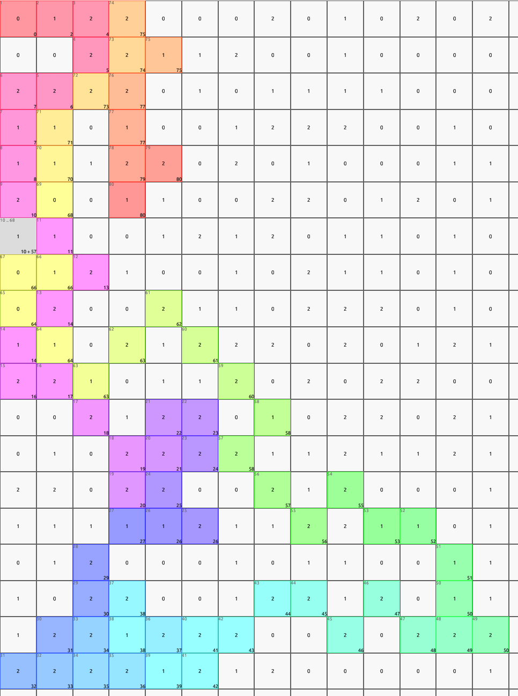

# rimor
This is a simple undirected pathfinder implemented in Rust. 

### General requirements

The path finding algorithm assumes the following

- There are no obstacles in the grid
- The algorithm can move horizontally, vertically and diagonally
- The path has a maximum of T timesteps
- For each time step you can move to another adjacent cell
- When you visit a cell the score is reset to 0
- When you visit a cell the score for other cells is increased by the `recovery_rate` which is default 1
- The algorithm tries to find a path which yields a maximum score

Both the app/CLI allow you to load grid files which are formatted as a 2D array of integers, where each integer represents a score. Each line is a row and each line contains multiple integers separated by a space. The grid has a symmetrical height and width, so it's an N x N grid

### Visualization

You can visualize the working of the pathfinder by visiting the webpage which is hosted on [GitHub Pages](https://fristi.github.io/rimor). This is WebAssembly version which works well for 20x20 grids to demonstrate it visually. 

**Note that this only seems the work with Chromium based browsers, like Chrome, Brave and Edge.**

You can use this file [3 x 3 grid](https://github.com/Fristi/rimor/blob/main/3x3.txt) to test the visualization. The file is a 2D array of integers, where each integer represents a score. Each line is a row and each line contains multiple integers separated by a space. The grid has a symmetrical height and width, so it's an N x N grid



#### Features
- You can load a grid from a file
- You can click on a tile which will have a red border, this does indicate the **start** tile
- You can tweak parameters like recovery rate, timesteps and the algorithm on the fly
- When you press **find path** it will show the score on the right and a path which changes color to easily track where it is going.
- Once a path is set, you can track it's exact path by looking at
  - The **top left** of a tile which shows the step
  - The **bottom right** of a tile which shows the score

### CLI

Another option for larger grids is to use the CLI version. This is a Rust CLI application which can be used to find the most feasible path in a grid. It is designed to work with larger grids, up to 1000x1000 and more

```bash
cli -I /Users/{user}/Downloads/grids/1000.txt -T 100 -x 1 -y 2 --timeout 100
```

### Available algorithms

#### Best First Search

This is a greedy algorithm which tries to find the best path by exploring the most promising nodes first. For each node it visits it get the adjacent nodes and put these values in priority queue and in the next step it will explore the item which has the highest score in the queue. The time complexity is O(T) which is fast, but it will miss the nodes with high scores which are in reach and not considered with this approach

### Considered methods

#### Breadth First Search
This is a brute force algorithm which tries to find the best path by exploring all the nodes. It will visit all the nodes in the grid and will try to find the best path. Since there are cycles in the grid the time complexity grows exponentially. I've stopped exploring this approach

#### Linear programming
This is a mathematical approach which tries to find the best path by solving a linear programming problem. It will try to find the best path by solving the problem with the given constraints and objective function. Linear programming is used to solve optimization problems, which this is in a sense (maximize the score). In practice this has been used for example knapsack, travel salesman, bin packaging, etc.

##### objective function

```
maximize(x1 * score1 + x2 * score2 + x3 * score3 + ... + xn * scoren)
```

Where `x1..n` is the edge as binary variable (either 0 or 1) and `score1..n` the score you would get from visiting that node at the moment. At the moment the `score` is a coefficient which makes this a linear programming problem. If you would adjust the score over time you would make the score a variable as well which would make this a quadratic programming problem. I didn't reach that approach yet

##### constraints

Leave the _start_ node (any of the edges should be 1)

```
x1 + xn == 1
```

Flow conservation

```
edges_in - edges_out == 0
```

Where `edges_in` and `edges_out` is the sum of variables associated with the edges, if you subtract them they would end up as zero. This means that if you would visit a node you will also leave the node

Number of edges

```
sum(x1..n) == max_timesteps
```

This will count the number of edges you would visit. This is a constraint which is needed to make sure that you don't visit more edges than the maximum number of timesteps

### Unexplored approaches

#### Swarm intelligence

#### Multi agent pathfinding

The problem of Multi-Agent Pathfinding (MAPF) is an instance of multi-agent planning and consists in the computation of collision-free paths for a group of agents from their location to an assigned target.

I don't have expertise in this field, but I think this is a good approach to explore. Due to time constraints I didn't have time to explore this approach.

#### Permutation-Based Sequential Best-First Multi-Agent Exploration

Sequential best-first search with agent order permutation and coverage-based constraints for maximizing score without explicit goals.

In other words, it would use the best first search approach, but it will create a permutation list of all the starting order and loop over them. For each invocation of the best first search function it would include the already covered paths, so you maximize the score. This is a brute force approach which has a time complexity of O(N! * T) where N is the number of agents and T is the number of timesteps. 


